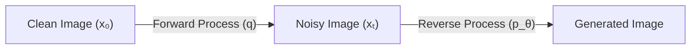

# Diffusion Models: Core Concepts & Math Study Guide

This guide breaks down the core concepts and mathematical mechanics behind Denoising Diffusion Probabilistic Models (DDPM). These are the exact mathematical frameworks powering state-of-the-art generative image models.

---

## 1. The Core Philosophy
A diffusion model works through a two-step process:
1.  **Forward Process (Diffusion)**: We take a clean image and systematically corrupt it with noise over $T$ timesteps until it becomes pure random static.
2.  **Reverse Process (Denoising)**: We train a neural network (typically a U-Net) to learn how to undo this corruption. By predicting the noise added at each step, the network can start with pure random static and generate a brand-new, realistic image.



---

## 2. Unpacking the Terminology
When studying diffusion, researchers write:
> "$\epsilon$ is a tensor of random numbers drawn from a standard normal distribution (pure Gaussian noise)."

Here is what that means in plain English:
*   **Tensor**: A multi-dimensional grid of numbers. If we are adding noise to a `(28, 28)` grayscale image, our noise tensor ($\epsilon$) must also be a grid of shape `(28, 28)` so that every pixel gets its own random noise value.
*   **Standard Normal Distribution**: A statistical bell curve where:
    1.  **Mean ($\mu$) is 0**: The numbers average out to zero. Some make pixels brighter (positive numbers), others make them darker (negative numbers).
    2.  **Standard Deviation ($\sigma$) is 1**: About 68% of the values fall between $-1$ and $+1$. Values outside $-3$ and $+3$ are extremely rare.
*   **Gaussian Noise**: Noise generated using the normal distribution formula. Visually, it looks exactly like the "static" or "snow" on an old analog TV screen.

---

## 3. The Noise Schedule ($\beta_t$ and $\alpha_t$)
To destroy the image gradually, we define a variance schedule at each timestep $t$ from $1$ to $T$:
*   **$\beta_t$ (Beta)**: The variance of noise added at step $t$. Typically, $\beta$ starts very small (e.g., $\beta_1 = 10^{-4}$) and scales up linearly to a larger value (e.g., $\beta_T = 0.02$).
*   **$\alpha_t$ (Alpha)**: Defined as $1 - \beta_t$. This represents the proportion of the original image signal we **preserve** at step $t$.

---

## 4. The Direct Sampling Formula ("Bar Alpha" $\bar{\alpha}_t$)
Instead of iteratively adding noise step-by-step 300 times, we can jump directly to the noisy image $x_t$ at any timestep $t$ using the cumulative product of alphas:

$$ \bar{\alpha}_t = \prod_{s=1}^t \alpha_s $$

The closed-form equation to get $x_t$ directly from the clean image $x_0$ is:

$$ x_t = \sqrt{\bar{\alpha}_t} x_0 + \sqrt{1 - \bar{\alpha}_t} \epsilon $$

### Understanding the Terms:
1.  **$\sqrt{\bar{\alpha}_t} x_0$ (Signal Scale)**: Dictates how much of the original clean image is preserved.
2.  **$\sqrt{1 - \bar{\alpha}_t} \epsilon$ (Noise Scale)**: Dictates how much of the random static is mixed in.

---

## 5. Why Do We Square Root the Scales?
Why do we scale $x_0$ by $\sqrt{\bar{\alpha}_t}$ and $\epsilon$ by $\sqrt{1 - \bar{\alpha}_t}$ instead of using linear scaling?

### Preserving Variance (Energy)
In deep learning, we normalize model inputs to have a variance of $1.0$. If the variance of our images changes at different timesteps, the neural network will become unstable.

According to probability theory, when we scale and add two independent random variables $A$ and $B$, the variance of the result is:

$$ \text{Var}(aA + bB) = a^2 \text{Var}(A) + b^2 \text{Var}(B) $$

Since the variance of our original image $x_0$ and our random noise $\epsilon$ are both $1.0$:

$$ \text{Var}(x_t) = a^2(1) + b^2(1) = a^2 + b^2 $$

To keep the total variance of the noisy image $x_t$ exactly equal to $1.0$ at every single timestep, we must satisfy the equation:

$$ a^2 + b^2 = 1 $$

By setting:
*   $a = \sqrt{\bar{\alpha}_t}$
*   $b = \sqrt{1 - \bar{\alpha}_t}$

We guarantee that:

$$ (\sqrt{\bar{\alpha}_t})^2 + (\sqrt{1 - \bar{\alpha}_t})^2 = \bar{\alpha}_t + 1 - \bar{\alpha}_t = 1.0 $$

This ensures that the total "energy" (scale/contrast) of the image remains perfectly consistent throughout the entire diffusion process.

---

## 6. U-Net Architecture Intricacies (Phase 2)

The U-Net acts as the denoising engine. It takes a noisy image tensor `(Batch, Channels, Height, Width)` and a timestep tensor `(Batch,)` and predicts the added noise grid `(Batch, Channels, Height, Width)`.

### Sinusoidal Time Embeddings
We convert the integer timestep $t$ into a high-dimensional vector using sinusoidal position embeddings (similar to Transformers):
$$ \text{PE}(t, 2i) = \sin\left(\frac{t}{10000^{2i/d}}\right), \quad \text{PE}(t, 2i+1) = \cos\left(\frac{t}{10000^{2i/d}}\right) $$
*   **Intuition**: High-frequency waves capture minute step-to-step differences (e.g. $t=149$ vs $t=150$), while low-frequency waves capture the general noise phase (the "dials on a clock" metaphor).

### Time Vector Projection & Broadcasting
Inside each `ConvBlock`, we project the time embedding to match the layer's channel count and broadcast it across the spatial dimensions:
```python
t_val = self.time_mlp(t_emb)    # Shape: (Batch, out_ch)
h = h + t_val[:, :, None, None] # Reshaped to (Batch, out_ch, 1, 1) and broadcasted across H & W
```

### Skip Connections & Tensor Dimensions
To preserve fine-grained spatial details lost during downsampling (pooling), the U-Net copies feature maps from the encoder (downward path) and concatenates them directly with the corresponding decoder layers (upward path):

```
Encoder Path:
Input (1, 28, 28) ──> ConvBlock ──> h1 (32, 28, 28) ──> Pool ──> (32, 14, 14)
                                    h2 (64, 14, 14) ──> Pool ──> (64, 7, 7)

Bottleneck:
                                    b  (128, 7, 7)

Decoder Path:
(128, 7, 7) ──> Upsample ──> (128, 14, 14) ──> concat(h2) ──> (192, 14, 14) ──> Conv ──> (64, 14, 14)
(64, 14, 14) ──> Upsample ──> (64, 28, 28)  ──> concat(h1) ──> (96, 28, 28)  ──> Conv ──> (32, 28, 28) ──> Output (1, 28, 28)
```

---

## 7. Diffusion Training Loop (Phase 3)

The training loop learns to predict the noise $\epsilon$ added at any random timestep $t$:

### MSE Loss Formulation
Instead of predicting $x_0$ directly, the model minimizes the Mean Squared Error (MSE) between true noise $\epsilon$ and predicted noise $\hat{\epsilon}$:
$$ \mathcal{L}_{\text{simple}} = \mathbb{E}_{t, x_0, \epsilon} \left[ \| \epsilon - \text{UNet}(x_t, t) \|^2 \right] $$

### 6-Step Batch Training Routine
1. Sample clean batch $x_0 \sim \text{MNIST}$.
2. Sample random timesteps $t \sim \text{Uniform}(0, T-1)$.
3. Sample Gaussian noise $\epsilon \sim \mathcal{N}(0, \mathbf{I})$.
4. Compute noisy batch $x_t = \sqrt{\bar{\alpha}_t} x_0 + \sqrt{1 - \bar{\alpha}_t} \epsilon$.
5. Pass through model: $\hat{\epsilon} = \text{UNet}(x_t, t)$.
6. Backpropagate $\text{MSE}(\hat{\epsilon}, \epsilon)$ and update weights.

---

## 8. Reverse Denoising Sampler (Phase 4)

To generate new images, we start with pure Gaussian noise $x_T \sim \mathcal{N}(0, \mathbf{I})$ and iterate backwards from $t = T-1$ down to $0$.

### DDPM Reverse Step Equation
$$ x_{t-1} = \frac{1}{\sqrt{\alpha_t}} \left( x_t - \frac{\beta_t}{\sqrt{1 - \bar{\alpha}_t}} \text{UNet}(x_t, t) \right) + \sigma_t z $$

Where:
*   $\sigma_t = \sqrt{\beta_t}$ is added stochastic noise (for $t > 0$, and $z = 0$ at $t = 0$).
*   The subtraction $\left( x_t - \frac{\beta_t}{\sqrt{1 - \bar{\alpha}_t}} \hat{\epsilon} \right)$ strips away the estimated noise.
*   Dividing by $\sqrt{\alpha_t}$ rescales the signal up to match the preceding timestep's variance schedule.
